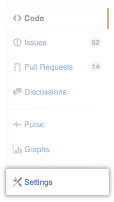
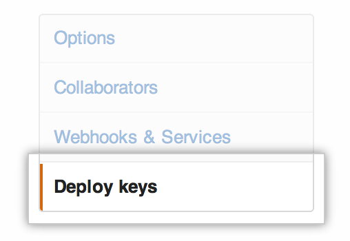

# 管理部署密钥

* i.	SSH agent 转发
* ii.	通过 OAuth 令牌进行 HTTPS clone
* iii.	部署密钥
* iv.	机器用户

在你自动化部署脚本时，一共有四种方式来管理你的服务器的 SSH 密钥：

* SSH agent 转发
* HTTPS + OAuth 令牌
* 部署密钥
* 机器用户

这个指南会帮你确定哪一种策略是最适合你。

## SSH agent 转发

在许多情况下，特别是在一个项目的初始阶段，SSH agent 转发是最简单、最快捷的办法，该功能使用的密钥和你本地开发电脑所使用的密钥相同。

#### 优点

* 你不需要生成或者监视记录任何新的密钥。
* 没有密钥管理；用户在服务器上拥有和本地一样的权限。
* 没有任何密钥存放在服务器上，所以即使服务器被攻陷，你也不需要寻找并删除已经沦陷的密钥。

#### 缺点

* 用户**必须**通过 SSH 连接来部署；这意味着不能使用自动化部署技术。
* SSH agent 转发对于 Windows 用户来说运行起来稍显繁琐。 

#### 设置

1.  要在本地打开 agent 转发，请查看[我们的 SSH agent 转发指南](/using-ssh-agent-forwarding/)来获取更多信息。
2.  将你的部署脚本设定为使用 agent 转发。举例来说，在 bash 脚本里，启用 agent 转发应该和这个代码类似：`ssh -A serverA 'bash -s' < deploy.sh`

## 通过 OAuth 令牌进行 HTTPS clone

如果你不想使用 SSH 密钥，你可以使用[带 OAuth 令牌的 HTTPS](https://help.github.com/articles/git-automation-with-oauth-tokens)。

#### 优点

* 任何具有访问服务器权限的人都能部署存储库。
* 用户不必变更他们的本地 SSH 设置。
* 多个用户不需要准备多个令牌；一个服务器只需要一个令牌。
* 令牌可以随时被废除，几乎可以当作一个一次性密码。
* 可以很简单地用脚本通过[OAuth API](https://developer.github.com/v3/oauth_authorizations/#create-a-new-authorization)生成新令牌。

#### 缺点

* 您必须确认你的令牌的访问域已经被正确配置。
* 令牌的本质就是密码，所以需要和密码一样被保护起来。

#### 设置

请参照[通过令牌的 Git 自动化指南](https://help.github.com/articles/git-automation-with-oauth-tokens)。

## 部署密钥

部署密钥是一个存放在你的服务器上并且可以授权访问一个 GitHub 存储库的 SSH 密钥。这个密钥是直接附在存储库上的，而不是个人用户账户。

#### 优点

* 任何具有访问存储库权限的人都可以部署工程。
* 用户不需要改变他们本地的 SSH 设定。

#### 缺点

* 一个部署密钥只能授权一个存储库。而更复杂的工程可能会在同一个服务器上对许多存储库发出 pull 操作。
* 部署密钥总是提供对一个存储库的完整读写访问权限。
* 部署密钥通常没有经过密码保护，如果服务器被攻陷这些密钥将会很容易被获取。

#### 设置

**1.** 在你的服务器上[执行 `ssh-keygen` 程序](https://help.github.com/articles/generating-ssh-keys)。

**2.** 在任意 GitHub 页面的右上角，点击你的用户相片。

**3.** 在你的用户页面内，点击 **Repositories** （存储库）标签页, 然后点击你的存储库的名字。

**4.** 在你的存储库的右边栏中，点击 **Settings**（设定）。

**5.** 在侧边栏中，点击 **Deploy Keys**（部署密钥）。

**6.** 点击 **Add deploy key**（添加部署密钥）。 将你的公钥粘贴进去，并且提交。

## 机器用户

如果你的服务器需要访问多个存储库，你可以选择创建一个新的 GitHub 账户然后附上一个仅用于自动化操作的 SSH 密钥。因为这个 GitHub 账户不会被任何人类使用，所以被称作机器用户。接下来，你可以[添加机器用户为合作者](https://help.github.com/articles/how-do-i-add-a-collaborator)，或者[将机器用户添加到队伍里](https://help.github.com/articles/adding-organization-members-to-a-team)并给与自动化所需的存储库访问权限。
  
**注意**：添加一个机器用户作为合作者将会赋予其完整读写访问权限。而添加一个机器用户进队伍则会赋予它队伍的权限。

**提示**：我们的[服务条款](https://help.github.com/articles/github-terms-of-service)特地提到*“ ‘bot’（机器人）或者其他自动化手段所创建的用户是不被允许的”*，还有*“一个自然人或者法人不得持有多于一个免费账户”*。不过不要害怕，我们不会派出极端的律师来和你纠缠到底，只要你所创建的机器用户只是用于服务器部署脚本。本文提到的机器用户是完全合法的。

#### 优点

* 任何有权限访问存储库和服务器的人都能部署工程。
* 没有任何（人类）用户需要更改他们的本地 SSH 设定。
* 不需要多个密钥；一个服务器一个密钥已然足够。

#### 缺点

* 只有组织有权限创建队伍；所以只有组织可以用其来限制机器用户的权限为只读。个人存储库只能对机器用户授予合作者权限，也就是读写。 
* 机器用户密钥，和部署密钥一样，通常没有密码保护。

#### 设置

1.  在你的服务器上[执行 `ssh-keygen` 程序](https://help.github.com/articles/generating-ssh-keys)，然后为机器用户账户附上公钥。 
2.  给那个账户所需要访问的存储库的访问权限。你可以通过[添加账户为合作者](https://help.github.com/articles/how-do-i-add-a-collaborator)或者在组织内[添加账户到队伍](https://help.github.com/articles/adding-organization-members-to-a-team)来做到这点。